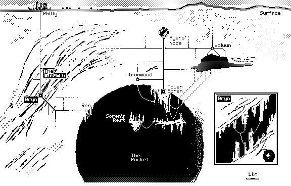

# sonoshee

sonoshee is a hodge-podge collection of image manipulation scripts I've written for fun side projects.

## poodle

A esoterically useful byte-to-png converter specifically designed around the [.icn file format](https://wiki.xxiivv.com/site/icn_format.html). Currently, `poodle` is even more specialized around `.icn` outputs from [Noodle](https://wiki.xxiivv.com/site/noodle.html) a 1-bit minimalist drawing app.

To Poodle a Noodle: `python poodle.py -i {Noodle .icn file}`

I recommend making a bash alias: `alias poodle='python {path_to_poodle.py} -i'` so that you can Poodle Noodles more easily: `poodle {file}` 

## pixel-sort

A pixel sorter that utilizes Sobel filter masking to selectively sort image pixels. With several scale factor knobs, image series can be generated and stitched into glitchy gifs. 

Without filter masking, images are smeared by organizing pixels by their perceived luminosity.

WIP - I still need to add argparse and logging.

