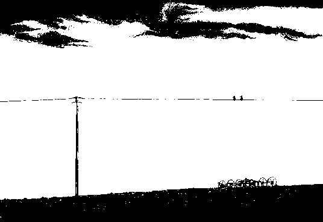
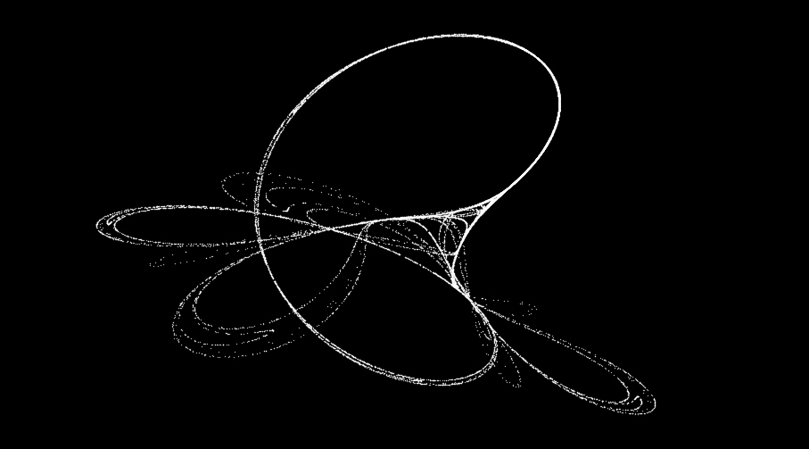

# sonoshee

sonoshee is a hodge-podge collection of art/art-adjacent scripts I've written for fun side projects.

## Visual

Visual tools and generative art.

### poodle

A esoterically useful byte-to-png converter specifically designed around the [.icn file format](https://wiki.xxiivv.com/site/icn_format.html). Currently, **poodle** is even more specialized around `.icn` outputs from [Noodle](https://wiki.xxiivv.com/site/noodle.html) a 1-bit minimalist drawing app.

To Poodle a Noodle: `python poodle.py -i {Noodle .icn file}`

I recommend making a bash alias: `alias poodle='python {path_to_poodle.py} -i'` so that you can Poodle Noodles more easily: `poodle {file}` 

### doodle

The logical counterpart to **poodle**, converts `.png` files to `.icn` format for use in [Noodle](https://wiki.xxiivv.com/site/noodle.html). With **poodle**, a **doodled** `.png` can be conveted back to a `.png` from `.icn`. The result is a monochrome pixel filter. As a filter-applier, **doodle** is extremely slow since the original `.png` must be processed in 8x8 chunks to adhere to the format **Noodle** expects. But it nonetheless can get the job done.

Current issues: How can **doodle** be made to work with `.jpg` files? Why is it, when I use `convert` to scale an image file's dimensions **doodle** breaks?

### pixel-sort

A pixel sorter that utilizes Sobel filter masking to selectively sort image pixels. With several scale factor knobs, image series can be generated and stitched into glitchy gifs. 

Without filter masking, images are smeared by organizing pixels by their perceived luminosity.

WIP - I still need to add argparse and logging.

### tinker

The [Tinkerbell Map](https://en.wikipedia.org/wiki/Tinkerbell_map) is a class of chaotic dynamical system known as an *attractor* in which the system tends to evolove to a state or set of states.

The Tinkerbell attractor can be described by:

$$x_{n+1}=x_{n}^{2}-y_{n}^{2}+ax_{n}+by_{n}$$

$$y_{n+1}=2x_{n}y_{n}+cx_{n}+dy_{n}$$

* `tinker.py` - Calculates the Tinkerbell Map with 2e4 iterations by default. Saves the image as tink_0000.png in `/figures`.
* `plotTinkerLots.py` - Performs the same task as main.py but recalculates the Map with a varied parameter and repeats, saving an image each time.

Using `plotLots.py` you can create a series of 'related' frames yourself. I stitched mine together [into a .mov](https://www.youtube.com/watch?v=-YG6t0bnfIo "The Tinkerbell Map") using `ffmpeg`.

This code requries `numpy` and `matplotlib` and was intended for python versions 3.X. Feel free to use any or all of this code.

## Textual

Text-based tools and generative art.

### OhHiMarkov

Given a `.txt` file, generate a one-ahead Markov chain for all word pairs. Generate a string of text `n` words long by navigating the Chain.

`python maketxt.py` 

Reads entire target folder's content and parses for 
 text, saving as a .txt file.

`python markov.py 20 <mytext.txt`

Generates a 20-word long sentence using a Markov Chain constructed from mytext.txt contents.

Sample sentences after consuming the contents of [my personal blog](https://www.slewis.wiki):
* Departure from determinism and rigid logic is difficult to accept, let alone a tree within this desert.
* Drove for a lunch buffet where the chefs seemed to be a lovely constant in my life.

## Other

* `periodictabel.py` - CLI tool for periodic table of elements lookup. Reads from `elements.tsv`. 